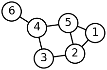
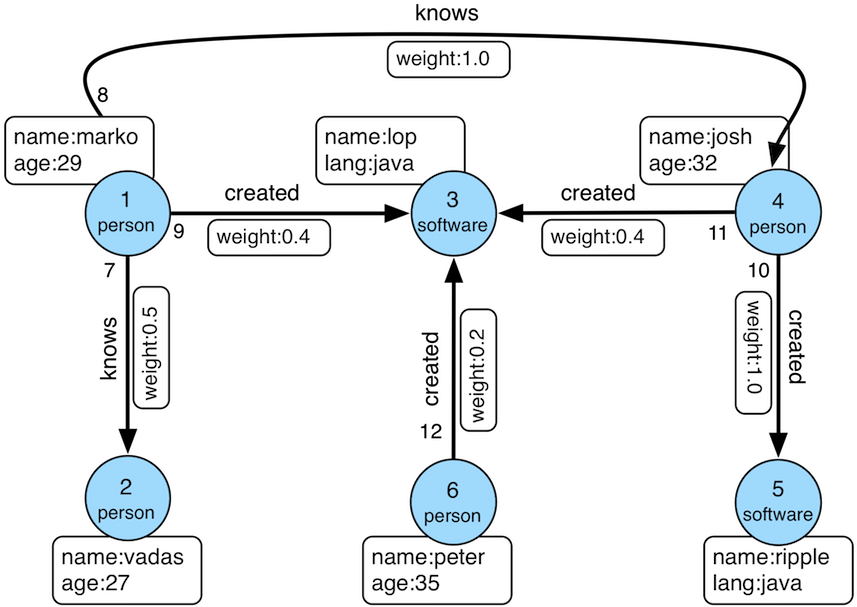

# First Slide
Today I will take a little bit about Tinkerpop and Graphs

# Slide 1

## What is Tinkerpop?
Apache TinkerPop is a graph computing framework and open source project hosted by the Apache Software Foundation.

## What is a Graph?

A graph is a data structure composed of vertices (nodes) and edges (lines). 
Graphs are versatile tools used to represent various relationships and processes in the real world.

## Why should we use a Graph Database?
- provide graph models to represent relationships in data
- execute traversal queries based on those relationships and apply graph algorithms to find patterns, paths, and other relationships (more efficient against massive amounts of data)

Since graph databases explicitly store relationships, queries and algorithms utilizing the connectivity between vertices can be run in sub-seconds rather than hours or days. Users don’t need to execute countless joins and the data can more easily be used for analysis and machine learning.

Graphs and graph databases provide graph models to represent relationships in data. They allow users to perform “traversal queries” based on connections and apply graph algorithms to find patterns, paths, and other relationships, which enable more efficient analysis at scale against massive amounts of data. 
The power of graphs is in analytics, the insights they provide, and their ability to link disparate data sources.

## Comparison with Relational Database
One of the relational model's design motivations was to achieve a fast row-by-row access.[18] Problems arise when there is a need to form complex relationships between the stored data. Although relationships can be analyzed with the relational model, complex queries performing many join operations on many different attributes over several tables are required. In working with relational models, foreign key constraints should also be considered when retrieving relationships, causing additional overhead.

Compared with relational databases, graph databases are often faster for associative data sets[citation needed] and map more directly to the structure of object-oriented applications. They can scale more naturally[citation needed] to large datasets as they do not typically need join operations, which can often be expensive. As they depend less on a rigid schema, they are marketed as more suitable to manage ad hoc and changing data with evolving schemas.

Conversely, relational database management systems are typically faster at performing the same operation on large numbers of data elements, permitting the manipulation of the data in its natural structure. Despite the graph databases' advantages and recent popularity over[citation needed] relational databases, it is recommended the graph model itself should not be the sole reason to replace an existing relational database. A graph database may become relevant if there is an evidence for performance improvement by orders of magnitude and lower latency.[19]

## TinkerPop major components
- Gremlin (A graph traversal (query) language)
- The Gremlin Console (provides simple REPL access to a graph)
- Gremlin Server (implementation that can be used to host remote graphs)
- The TinkerGraph (in memory graph database)
- Client drivers (that support a number of popular programming languages)
- Support for both OLTP (graph databases) and OLAP(graph analytic systems) access patterns
- Programming interface (written in Java)

## Use cases

- Social Networks - Unleash the power of a social network by using relationships between individuals to infer and recommend connections.
- Fraud Detection - Leverage the connections inherent in a financial transaction to provide real-time analysis and detection for known fraudulent patterns of activity.
- Knowledge Graphs - Unite disperate data sources and data silos to provide contextually relevant information to queries.
- Recommendation Engines - Provide real-time personalized recommendations for products, services and content by utilizing connections within data.
- Identity/Access Management - Effectively and effciently track user activity and access using a graph of assets and relationships.
- Customer 360 - Leverage disconnected data sources to provide a holisitic 360 degree view of customer interactons
- Master Data Management - Organize and provide access to canonical master data by combining data in a schemaless and flexible manner.
- Supply Chain Management - Manage and visualize complex interconnected supply chains to identify optimizations and assess risk.
- Compliance - Ensure effective compliance by examining and evaluating entities against a network of applicable interconnected regulations.

## Why TinkerPop

Using TinkerPop framework developers can create their graph apps without being tied to a specific graph database.
Add some other benefits

# References

- https://kelvinlawrence.net/book/Gremlin-Graph-Guide.html#whygraph
- https://www.techtarget.com/searchdatamanagement/feature/Graph-database-vs-relational-database-Key-differences
- https://en.wikipedia.org/wiki/Graph_database
- https://aws.amazon.com/blogs/opensource/why-developers-like-apache-tinkerpop-an-open-source-framework-for-graph-computing/
- https://tinkerpop.apache.org/benefits-use-cases.html
- https://www.oracle.com/autonomous-database/what-is-graph-database